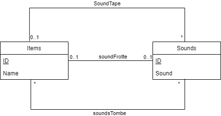

# Définition du sujet
Nous avons décidé de partir sur 2 tables. La première contient des objets, et la seconde contient des sons.  
Les objets peuvent posséder des sons pour plusieurs actions différentes et peuvent être créés et modifiés au travers de 
l'API.  

Les son eux ne peuvent pas être créés au travers de l'API et doivent forcéments être créés depuis le code source. 
Nous avons pris cette décision car notre "métier" est la gestion des objets, nous partons donc du principe que ce n'est 
pas à nous de gérer les sons.

# UML de la DB

# Description des Endpoints

Pour savoir ce que nécessite les requêtes aux endpoints, se référer soit à la doc accessible après avoir lancé le projet quotes-exemple, à l'adresse http://localhost:9090/api par défaut, soit à la vidéo ci-dessous pour des exemples d'utilisation avec Postman.

## Endpoints pour les items

- GET /items : Permet de récupérer la liste de tous les items présents dans la DB Items.
- PUT /items : Permet de créer, ou s'il existe déjà un item avec cet id, d'écraser cet item dans la DB.
- POST /items : Création d'un nouvel item dans la DB. Echoue si l'item existe déjà
- PATCH /items : Modification d'un item dans la DB. Echoue si l'item n'existe pas
- GET /items/{id} : Récupère un item spécifique dans la DB.
- DELETE /items/{id} : Supprime un item spécifique dans la DB.

## Endpoint pour les sons

- GET /sounds : Récupère la liste des sons stockés dans la DB Sounds.

# Vidéo explicative du projet
<i>[A venir](https://www.youtube.com/watch?v=dQw4w9WgXcQ)</i>

# quotes-exemple
Mise en oeuvre d'une api avec Springboot et d'un client de test BDD avec Cucumber 
Avec OpenApi generator, génération à partir d'un fichier OpenAPI "quotes.yaml" :
 - des intertaces et des DTO pour Springboot
 - d'un client et des DTO pour le client BDD

 ## Installation et utilisation avec IntelliJ
  - git clone de ce repository et import sous IntelliJ du projet (maven) qui contient 2 modules : quotes-api pour Springboot
 et quotes-spec pour le client BDD
  - Affectation d'un Java JDK 17 (File / Project structure / Project /SDK
 ### quotes-api
  - Gérération du dossier target avec "maven clean package" (fenêtre Maven, quotes-exemple/quotes-api/Lifecycle)
  - Déclaration "Generated Source Root" du dossier target/generated-sources/openapi/src/main/java 
    via le menu contextuel et "Mark directory as" sur ce dossier
  - Lancement du main Springboot (Swagger2SpringBoot)
  - L'interface utilisateur swagger-ui est accessible à http://localhost:9090/api
  - La base de donnée H2 est accessible à http://localhost:9090/api/h2-console
      url: jdbc:h2:mem:testdb username:sa pas de password
  ### quotes-spec
  - Gérération du dossier target avec "maven clean package" (fenêtre Maven, quotes-exemple/quotes-spec/Lifecycle)
    si Springboot tourne, les tests BDD doivent s'exécuter sans erreurs au cours de l'exécution de Maven
  - Déclaration "Generated Source Root" du dossier target/generated-sources/openapi/src/main/java 
  - La Feature Cucumber du dossier src/test/resources/features/quotes.feature doit être exécutable sous IntelliJ

  ## Cycle de développement
  - Modifier le fichier OpenAPI "quotes.yaml" sous src/main/resource des 2 projets (copies identiques)
  - Api Springboot
    - Relancer "maven clean package" de quotes-api
    - Développer ou adapter les controlleurs, les DTO et les classes liées dans l'api Springboot
    - Si vous avez ajouté ou modifié des entités, vous pouvez initialiser des données 
      dans le fichier data.sql de src/main/resource
    - Relancer Sprigboot et faire quelques tests manuels avec swagger-ui
  - Tests BDD cucumber (en mode TDD, les 2 premières étapes peuvent être effectuées avant le développement de l'api)
    - Relancer "maven clean package" de quotes-spec, les tests seront peut-être en erreur et peuvent être skippés
    - Développer ou adapter les features Cucumber et les steps pour les nouvelles fonctionalités
    - Exécuter les tests sous IntelliJ et relancer "maven clean package" de quotes-spec pour exécuter les tests avec Maven
